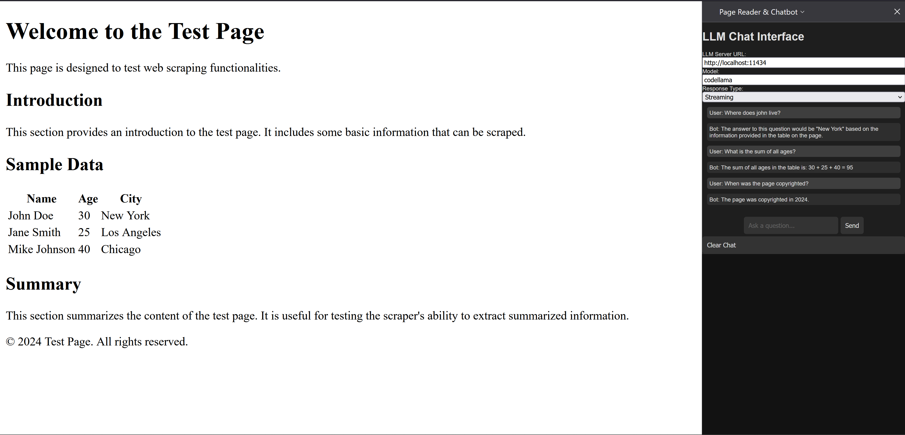

# browser-assistant

An AI browser assistant addon for Firefox that can read the text on the screen and have a chat about it. Tested with LLM backend [Ollama](https://github.com/ollama/ollama) assumed to be hosted at `http://localhost:11434`.

## TODO
- [x] Talk to Ollama
- [x] Send text on screen as part of input context
- [ ] Use vision model to dynamically generate enriched alt text for images to be sent as text to the input context.
- [x] Make model and endpoint configurable
- [ ] Use [langchain](https://python.langchain.com/v0.2/docs/introduction/) to chunk and embed the page for real-time RAG

## Loading the extension in Firefox

Load the Extension in Firefox:

1. Install Firefox Developer Edition
2. Open Firefox and navigate to `about:debugging`
3. Click on "This Firefox" on the left hand side and then "Load Temporary Add-on".
4. Select the `manifest.json` file from your extension directory.

## Ollama

Be sure to set `OLLAMA_ORIGINS=*` environment variable. See "[how do I configure Ollama server?](https://github.com/ollama/ollama/blob/main/docs/faq.md#how-do-i-configure-ollama-server)"
